# Awesome Prompt Management Platforms & LLMOps Ecosystem 🚀

   

## 🌐 Top Prompt Management Platforms Ecosystem

**Curated List of SaaS Products & Open-Source GitHub Projects for Prompt Engineering, Prompt Registries, Version Control & LLMOps Observability** 🛠️

*Focused on Prompt Registries, Versioning, Collaboration, Experiments, Observability, Guardrails & LLM Application Lifecycle Management* 📈

📅 **Last updated: September 2026**

---

### 📌 Overview & Scope

This repository tracks notable **SaaS platforms** and **open-source projects** for **Prompt Management** and **LLMOps**. These tools empower AI engineers, product managers, and developers to store, version, label, collaborate on, experiment with, and deploy prompts for Large Language Model (LLM) applications—seamlessly integrating prompt engineering with tracing, evaluations, red-teaming, and production observability. 💡

⚡ **Key Highlights & Category Leaders**:
Includes leading solutions like **Langfuse**, **LangSmith**, **Humanloop**, **PromptLayer**, **Helicone**, **Portkey**, **Braintrust**, **Lunary**, **Weights & Biases Prompts**, **PromptHub**, **PromptPerfect**, **Promptitude**, **Agenta**, **Keywords AI**, and **Promptfoo**.

🔓 **Open-Source & Self-Hosted Emphasis**:
Prompt management has robust open-source alternatives. **Langfuse** leads as a self-hostable LLM engineering suite with native prompt version control. **LiteLLM**, **Agenta**, **Promptfoo**, **DeepEval**, and **Ragas** further extend the open ecosystem.

🤝 **Contributions Welcome**: Found a great prompt registry or LLMOps tool? Open a Pull Request to update entries!

---

## 📑 Table of Contents

- [☁️ SaaS / Hosted Platforms](#-saas--hosted-platforms)
- [💻 Open-Source GitHub Projects](#-open-source-github-projects)
- [🛠️ Key Features Comparison & Criteria](#-key-features-comparison--criteria)
- [🤝 How to Contribute](#-how-to-contribute)
- [📈 Star History](#-star-history)
- [⚠️ Disclaimer](#%EF%B8%8F-disclaimer)

---

## ☁️ SaaS / Hosted Platforms

📊 **Estimated Sector Market Size:** ~$1.5B–$2.5B (2026, within the broader LLMOps & AI Observability market projected at $5B+).  
🔄 **Market Dynamics:** Highly fragmented sector transitioning into a moderately concentrated landscape driven by rapid consolidation (acquisitions by OpenAI, Anthropic, Palo Alto Networks, CoreWeave, Elastic, and ClickHouse), with winner-take-most dynamics emerging around full-stack LLMOps and observability suites rather than standalone prompt registries.

| Product | Description | Company Scale (Valuation / Revenue) | Starting Price | Free Tier Limits |
| :--- | :--- | :--- | :--- | :--- |
| **[LangSmith](https://www.langchain.com/langsmith)** | LangChain’s platform for tracing, evaluation, prompt management, and experimentation tightly integrated with LangChain/LangGraph. | ~$1.25B Valuation (LangChain) / ~$16M ARR | $39/seat/mo (Plus plan) | 5,000 traces/mo, 14 days retention, 1 seat |
| **[Weights & Biases Prompts](https://wandb.ai/)** | Prompt and LLM experiment tracking capabilities within the broader Weights & Biases MLOps platform. | ~$1.25B Valuation (Acquired by CoreWeave) / ~$60M Revenue | $60/mo (Pro plan) | 5 seats, 5 GB storage, 1 GB/mo Weave ingestion |
| **[Braintrust](https://www.braintrust.dev/)** | Evaluation-first platform for prompt testing, versioning, datasets, and systematic improvement of LLM applications. | ~$800M Valuation / $121M Funding | $249/mo (Pro plan) | 1 GB processed data/mo, 10,000 scores/mo, $10 model credits/mo |
| **[Promptfoo](https://www.promptfoo.dev/)** | Open-source LLM evaluation and red-teaming tool with cloud options; supports prompt testing, comparison, and CI/CD integration. | ~$86M Valuation (Acquired by OpenAI) | $50/mo (Team plan) | 10,000 red team probes/mo & free unlimited local CLI usage |
| **[Portkey](https://portkey.ai/)** | AI gateway and observability platform that includes prompt management, routing, guardrails, and production controls. | ~$18M Funding (Acquisition announced by Palo Alto Networks) / ~$5M ARR | $49/mo (Pro plan) | 10,000 recorded logs/mo, 3 days log retention |
| **[Humanloop](https://humanloop.com/)** | Prompt engineering and evaluation platform focused on collaboration and systematic improvement of LLM applications. | ~$7.9M Funding (Acqui-hired by Anthropic) / ~$3.8M ARR | Contact for Custom Enterprise pricing | Free Trial: 10,000 logs/mo, 50 eval runs, 2 seats |
| **[Langfuse](https://www.langfuse.com/)** | Open-source LLM observability and prompt management platform with versioning, labels, experiments, tracing, and evaluations (cloud and self-hosted). | ~$4.5M Funding (Acquired by ClickHouse) / ~$1.1M ARR | $29/mo (Core plan) | 50,000 units/mo, 30 days retention, 2 users |
| **[PromptLayer](https://www.promptlayer.com/)** | Prompt management and observability platform with versioning, release labels, A/B testing, and collaboration features for technical and non-technical users. | ~$4.8M Funding / ~$1.9M Est. ARR | $49/mo (Pro plan) | 2,500 requests/mo, unlimited logging, core versioning |
| **[Keywords AI](https://www.keywordsai.co/)** | LLM engineering platform with prompt management, observability, and related production features. | ~$1.1M Est. ARR / $500K Funding (YC) | Pay-as-you-go / Custom | Free starter tier: 100,000 logs, 1,000 scores, 5 datasets |
| **[Helicone](https://www.helicone.ai/)** | LLM observability platform with logging, cost tracking, and prompt-related production visibility (proxy-based). | ~$1M ARR (Acquired by Mintlify) / $500K Funding | $79/mo (Pro plan) | 10,000 requests/mo, 7 days retention, 1 GB storage, 1 seat |
| **[Promptitude](https://www.promptitude.io/)** | Prompt management and workflow tools for teams building LLM applications. | ~$1.2M Est. ARR (Bootstrap / Seed) | $39/mo | 100 generations/mo, 200 tool calls/mo, 5 prompts, 2 seats, 50k tokens |
| **[Agenta](https://agenta.ai/)** | Open-source LLMOps platform focused on prompt engineering, versioning, evaluation, and collaboration (also offered as a hosted service). | ~$1.1M Est. ARR / Seed stage | $29/mo (Pro plan) | 5,000 agent runs/mo, 2 seats |
| **[PromptHub](https://www.prompthub.us/)** | Platform focused on sharing, discovering, and managing prompts. | ~$170K Est. ARR (Bootstrap / Seed) | $12/user/mo (Pro plan) | Free forever plan with unlimited public prompts & 2,000 requests/mo |
| **[PromptPerfect](https://promptperfect.jina.ai/)** | Tool aimed at optimizing and refining prompt quality. | Product of Jina AI ($36M Funding, Acquired by Elastic) | $9.99/mo (Lite plan) | Free signup credit allowance / 1 prompt optimization per day |
| **[Lunary](https://www.lunary.ai/)** | Open-source-friendly LLM observability and prompt management tool for tracking and improving prompts in production. | Bootstrap / Early stage | $20/user/mo (Team plan) | 1,000 events/day (or 10k/mo), 30 days retention, 1 seat |

---

## 💻 Open-Source GitHub Projects

- **[LiteLLM](https://github.com/BerriAI/litellm)**   
  High-performance AI Gateway with prompt management, logging, cost tracking, guardrails, and unified access to 100+ LLM APIs. 🛡️

- **[Langfuse](https://github.com/langfuse/langfuse)**   
  Leading open-source LLM engineering platform (MIT) featuring complete prompt management: versioning, release labels, evaluations, tracing, and prompt experiments. 🪢

- **[Promptfoo](https://github.com/promptfoo/promptfoo)**   
  Open-source CLI and library for automated testing, red-teaming, and benchmarking prompts, agents, and RAG architectures with CI/CD integration. 🎯

- **[DeepEval](https://github.com/confident-ai/deepeval)**   
  Open-source LLM evaluation framework for unit testing prompts, RAG pipelines, and agent behaviors with synthetic data generation. 🧪

- **[Ragas](https://github.com/explodinggradients/ragas)**   
  Framework for evaluating Retrieval-Augmented Generation (RAG) and prompt quality using automated metric scoring. 🚀

- **[Portkey Gateway](https://github.com/Portkey-AI/gateway)**   
  Fast open-source AI gateway supporting prompt routing, fallbacks, load balancing, and production guardrails. 🔑

- **[Arize Phoenix](https://github.com/Arize-ai/phoenix)**   
  Open-source AI observability and evaluation platform for tracking prompt performance, traces, and dataset metrics. 🔥

- **[OpenLLMetry](https://github.com/traceloop/openllmetry)**   
  Open-source OpenTelemetry-based observability for GenAI apps, enabling prompt and model interaction tracing across services. 📡

- **[Helicone](https://github.com/Helicone/helicone)**   
  Open-source LLM observability proxy for logging requests, monitoring prompt performance, costs, and request latency. 🧊

- **[Agenta](https://github.com/Agenta-AI/agenta)**   
  Open-source LLMOps workspace for prompt engineering, collaborative prompt testing, versioning, and evaluation. 🧠

- **[TruLens](https://github.com/truera/trulens)**   
  Instrumentation and evaluation library for tracking and scoring prompt performance in LLM applications. 🔍

- **[OpenLIT](https://github.com/OpenLIT/openlit)**   
  Open-source OpenTelemetry-native AI application observability and prompt performance monitoring suite. ⚡

---

### 💡 Architectural Recommendation & Open Source Patterns

- 🥇 **Complete Self-Hosted Suite**: Deploy **Langfuse** for end-to-end prompt version control, label release management, tracing, and evaluation.
- 🤝 **Prompt Collaboration**: Choose **Agenta** for a prompt-centric workspace designed for non-technical team collaboration and playground iteration.
- 🛡️ **CI/CD & Security Evals**: Implement **Promptfoo** or **DeepEval** in your build pipeline for automated prompt vulnerability scanning, red-teaming, and regression testing.
- 🔄 **Multi-LLM Proxy & Gateway**: Use **LiteLLM** or **Portkey Gateway** for unified API abstraction, prompt caching, fallback routing, and cost control.

---

## 🛠️ Key Features Comparison & Criteria

When selecting a **Prompt Management Platform** or **LLMOps Tool**, evaluate against these critical core capabilities:

1. **Prompt Version Control & Registries** 🏷️: Semantic versioning, release tags (e.g., `production`, `staging`), prompt templating, and zero-downtime deployment.
2. **Evaluations & Experimentation** 🧪: A/B testing, ground-truth dataset generation, LLM-as-a-judge scoring, and regression tracking.
3. **Observability & Tracing** 🔍: End-to-end trace collection, latency tracking, token usage monitoring, cost analytics, and span visualization.
4. **Collaboration & Security** 🔒: Role-based access control (RBAC), non-engineer prompt editors, audit logs, and SOC2/HIPAA compliance.

---

## 🤝 How to Contribute

Contributions are welcome! Help us keep this LLMOps & Prompt Management guide up to date:

1. 🍴 **Fork** this repository.
2. 📝 **Add or update** entries in `README.md` maintaining the existing structure.
3. 📌 **Provide Details**: Name, link, concise 1–2 sentence description, scale/pricing, and category.
4. 🚀 **Submit a Pull Request** with a brief summary of additions.

⭐ *If you find this directory helpful, please star this repository!*

---

## 📈 Star History

---

## ⚠️ Disclaimer

- This list is **community-curated** for informational purposes and does not constitute an endorsement.
- Prompt management solutions handle sensitive operational prompts and production LLM traffic data. Always review security, data privacy policies, and compliance standards (e.g., GDPR, SOC2) before deploying cloud or self-hosted solutions.

---

  <b>Made with ❤️ for AI Engineers, Prompt Engineers, and LLM Application Teams.</b>

